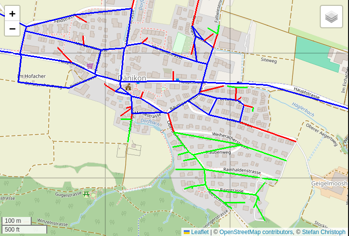

# Road Network Algorithms

## Project
Extract the road graph from OSM data dumps, implement various graph algorithms to preprocess the graph (for example [Tarjan](https://en.wikipedia.org/wiki/Bridge_(graph_theory)#Tarjan%27s_bridge-finding_algorithm) or [Louvain](https://en.wikipedia.org/wiki/Louvain_method)), and experiment with routing algorithms such as [Dijkstra](https://en.wikipedia.org/wiki/Dijkstra%27s_algorithm) or [A*](https://en.wikipedia.org/wiki/A*_search_algorithm).

## Status
Under Construction. Expect code to be buggy and unstable. Use at your own risk.

## Goals
* I do this for fun, and because I always wanted to program routing algorithms. These algorithms looked magic to me when I started to program many years ago.
* I want to utilize the 12 cores and 96GB Ram of my home computer, which normally just sits under my desk idling around.
* Develop efficient and simple routing algorithms that adapt to dynamic situations such as traffic jams or blocked roads. Because of this, it seems impossible (or too complicated) to use aggressive precomputation of routes as in [Contraction hierarchies](https://en.wikipedia.org/wiki/Contraction_hierarchies). 
* Routing should be efficient enough to run completely on smart phones. This helps protect the privacy of the user. Luckily, this becomes easier every year with improvements to the typical phone hardware. 

## Tasks done
1. Efficiently read OSM data dumps in pbf format with multiple threads ([read_osm_pbf.h](./src/osm-util/read_osm_pbf.h)).
2. Extract **country polygons** from OSM data dumps ([extract_admin.h](./src/bin/extract_admin.cpp)).
3. Given a point (lon,lat), efficiently find the country it belongs to ([tiled_country_lookup.h](./src/geometry/tiled_country_lookup.h)).
4. Support per-country defaults such as maxspeed and access. This uses a text config file, see [routing.cfg](./config/routing.cfg).
5. Find **dead end roads** and their associated bridges (see algorithm in [tarjan.h](./src/algos/tarjan.h)). Removing a bridge disconnects the graph at the bridge. The smaller of the two disconnected components is called dead end. Knowing dead ends is valuable, because they can be ignored for routing, unless the start or target nodes are in a dead end. See an example road network with some dead ends below (blue=road red=bridge green=dead end): 
6. Implement standard routing algorithms. Currently, uni-directional versions of [Dijkstra](./src/algos/dijkstra.h) and [A*](./src/algos/astar.h) exist.
7. **Visualization** is an important aspect when working with graph algorithms. The [tile server](https://switch2osm.org/using-tiles/) (see [tile_server.cpp](./src/bin/tile_server.cpp)) adds overlay images to standard osm graphs in the browser, see [leaflet.html](./src/html/leaflet.html).
8. Basic Stuff:
   * Use multiple threads ([thread_pool.h](./src/base/thread_pool.h))
   * Command line parsing ([argli.h](./src/base/argli.h))
   * Huge, dynamic bitsets ([huge_bitset.h](./src/base/huge_bitset.h))
   * Memory pool ([simple_mem_pool.h](./src/base/simple_mem_pool.h))
   * Varbyte encoding of numbers, strings and lists of node ids ([varbyte.h](./src/base/varbyte.h))
   * Line clipping on viewports, using [Cohen-Sutherland algorithm](https://en.wikipedia.org/wiki/Cohen-Sutherland_algorithm), see [line_clipping.h](./src/geometry/line_clipping.h).
   * Distance between points on the earth, using the [haversine formula](https://en.wikipedia.org/wiki/Haversine_formula), see [distance.h](./src/geometry/distance.h).

## Current Tasks
* Cluster the routing graph at the lowest level and for each cluster, precompute the cluster-internal routes between outside-connecting nodes. The user routing then runs on the much smaller graph induced by the clusters and the cluster-connecting edges. Precomputation of routes within clusters is done whenever needed and preferably on the user-device. Experimentation starts with the [Louvain method](https://en.wikipedia.org/wiki/Louvain_method), see  code in [louvain.h](./src/algos/louvain.h). 

## Tasks ahead
1. Store the routing graph in a file. Currently, the import of OSM data is re-done from scratch every time the routing graph is needed (see [build_graph_main.cpp](./src/bin/build_graph_main.cpp)).
1. Support more transportation means, especially bicycles and pedestrians. So far, development mainly targets cars.
1. Add routing configs for more countries (see [routing.cfg](config/routing.cfg)).
1. Support turn restrictions.
1. Assess the 'curviness' of ways and use it to lower maxspeed to real life values.
1. Support routing conditions from users, for instance "avoid toll roads", "stay withing country borders" or "only paved or better ways".
1. Support dynamic data such as traffic jams. This is similar to the previous point, since both require recomputation of travel times within clusters.
1. Support lanes. It isn't currently clear to me if lanes are needed for routing, or if they are only useful for the user experience during navigation.
1. Experiment with SIMD parallelization primitives available on modern processors, especially for cluster node travel time computation.

## Installation hints
1. Code is developed on a 64-bit PC (AMD64) using Ubuntu Linux. I haven't tried compiling or running it on any other operating system or platform.
1. The libraries abseil-cpp and cpp-httplib are imported as submodules. Run submodule update --init --recursive after cloning.
1. The libraries libgd-dev, libosmpbf-dev and zlib1g-dev have to be installed.
